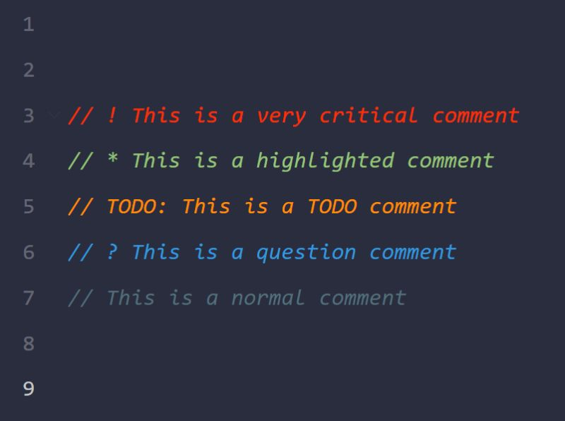

# VS Code extensions that makes life easier

## Better Comments
Use the `Better Comments` extension for VS Code to create... better comments. Super useful to distinguish between different types of comments like TODO's or critical information 🔥

    https://marketplace.visualstudio.com/items?itemName=aaron-bond.better-comments

    