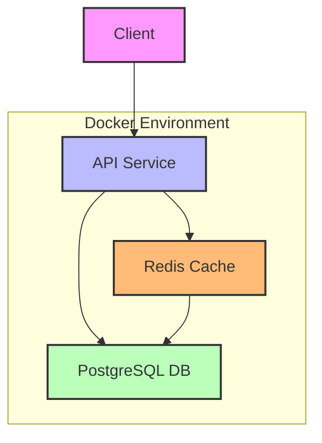

# Docker Notes App

A microservices-based application using Docker containers for managing notes with a Node.js API, PostgreSQL database, and Redis caching. This project can be cloned from [docker_notes_app](https://github.com/malkitsingh/docker_notes_app)

## Project Architecture



## Microservices Overview

The application is built using a microservices architecture with Docker containers:

1. **API Service**
   - Node.js-based REST API
   - Handles note operations (CRUD)
   - Communicates with both Redis and PostgreSQL
   - Located in `/api_service`

2. **PostgreSQL Service**
   - Primary data storage
   - Persists notes and user data
   - Custom initialization scripts
   - Located in `/postgres_service`

3. **Redis Service**
   - In-memory caching
   - Improves read performance
   - Reduces database load
   - Located in `/redis_service`

## Docker Commands Guide

Here are some essential Docker commands used in this project:

### Container Management

```bash
# Build an image
docker build -t api-service ./api_service

# Run a container
docker run -d -p 3000:3000 --name api api-service

# List running containers
docker ps

# Stop a container
docker stop api

# Remove a container
docker rm api

# View container logs
docker logs api

# Execute command inside container
docker exec -it api bash
```

### Image Management

```bash
# List images
docker images

# Remove an image
docker rmi api-service

# Clean up unused images
docker image prune

# Pull an image
docker pull node:16-alpine
```

### Network Management

```bash
# Create a network
docker network create notes-network

# List networks
docker network ls

# Connect container to network
docker network connect notes-network api

# Inspect network
docker network inspect notes-network
```

### Volume Management

```bash
# Create a volume
docker volume create postgres-data

# List volumes
docker volume ls

# Remove a volume
docker volume rm postgres-data

# Clean up unused volumes
docker volume prune
```

## Docker Compose Guide

Docker Compose simplifies managing multi-container applications. Here are key commands and examples:

### Basic Commands

```bash
# Start services
docker-compose up

# Start in detached mode
docker-compose up -d

# Stop services
docker-compose down

# View logs
docker-compose logs

# View service status
docker-compose ps

# Rebuild services
docker-compose build
```

### Service-Specific Operations

```bash
# Start specific service
docker-compose up api

# View service logs
docker-compose logs api

# Execute command in service
docker-compose exec api npm install

# Scale service (if configured)
docker-compose up -d --scale api=3
```

### Configuration Examples

Our `docker-compose.yml` manages three services. Here's an example structure:

```yaml
version: '3.8'

services:
  api:
    build: ./api_service
    ports:
      - "3000:3000"
    environment:
      - NODE_ENV=development
    depends_on:
      - postgres
      - redis

  postgres:
    build: ./postgres_service
    volumes:
      - postgres-data:/var/lib/postgresql/data
    environment:
      - POSTGRES_PASSWORD=secret

  redis:
    build: ./redis_service
    volumes:
      - redis-data:/data

volumes:
  postgres-data:
  redis-data:
```

### Environment Variables

Use `.env` files for environment-specific configuration:

```bash
# Development
docker-compose --env-file .env.dev up

# Production
docker-compose --env-file .env.prod up
```

## Getting Started

1. Clone the repository
2. Create necessary `.env` files
3. Start services: `docker-compose up -d`
4. Access API at `http://localhost:3000`

## Development Workflow

1. Make changes to service code
2. Rebuild affected service: `docker-compose build api`
3. Restart services: `docker-compose up -d`
4. View logs: `docker-compose logs -f`
