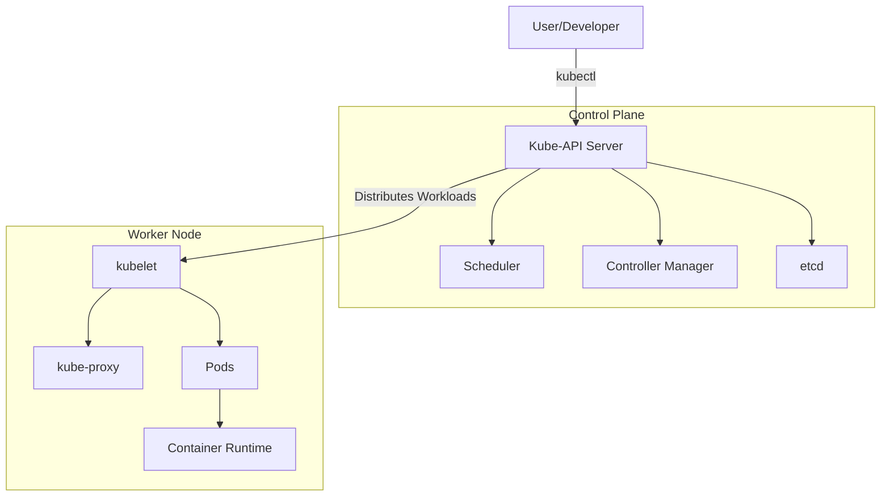

# Kubernetes Guide

### 1. Overview of Kubernetes

- **Container Orchestration:** Kubernetes manages containers (typically Docker containers) that run your applications, ensuring that the desired state (e.g., the number of replicas) is maintained.
- **Scalability and Resilience:** It helps automatically scale applications and recover from failures.
- **Portability:** Kubernetes runs on different environments—on-premises, in the cloud, or in hybrid setups.

### 2. Core Concepts and Components

#### A. Cluster Architecture
A Kubernetes cluster is made up of a control plane and a set of worker nodes.

- `Control Plane`: Responsible for managing the state of the cluster. Its key components include:

    - `API Server`: The entry point for all REST commands used to control the cluster.
    - `etcd`: A distributed key-value store that holds all cluster data.
    - `Scheduler`: Assigns workloads (pods) to nodes.
    - `Controller Manager`: Runs controllers to regulate the state of the cluster (e.g., ensuring the correct number of replicas).
- `Worker Nodes`: These nodes run your containerized applications. Each node contains:

    - `kubelet`: An agent that communicates with the control plane and manages pods.
    - `Container Runtime`: Software that runs the containers (e.g., Docker, containerd).
    - `kube-proxy`: Handles networking for pods, ensuring they can communicate within and outside the cluster.

#### B. Pods and Controllers
- `Pods`: The smallest deployable units in Kubernetes, which encapsulate one or more containers sharing storage, network, and specifications on how to run.
- `ReplicaSets`: Ensure a specified number of pod replicas are running at any time.
- `Deployments`: Provide declarative updates for Pods and ReplicaSets, making rollouts and rollbacks straightforward.

#### C. Services
Services provide a stable network endpoint to access a set of pods. They enable load balancing and service discovery across your applications.

#### D. Other Key Concepts
- `ConfigMaps & Secrets`: Manage configuration data and sensitive information separately from application code.
- `Volumes`: Allow persistent storage to be attached to pods.
- `Namespaces`: Help organize and isolate resources within the cluster.

### 3. Diagram: Kubernetes Architecture

Below is a diagram illustrating the overall Kubernetes architecture:

mermaid
Copy
Edit

_Diagram Explanation:_
- The **User/Developer** interacts with the cluster through `kubectl` to make changes.
- The **Control Plane** (API server, Scheduler, Controller Manager, etc.) manages the desired state.
- The **Worker Node** runs the applications inside pods, managed by components like the kubelet and kube-proxy.

### 4. Advanced Concepts

- **Auto-scaling**: Kubernetes supports Horizontal Pod Autoscaling (HPA) to automatically adjust the number of pod replicas based on metrics (e.g., CPU utilization).
- **Rolling Updates & Rollbacks**: Deployments allow updating applications with zero downtime and rollback if something goes wrong.
- **Helm**: A package manager for Kubernetes that helps manage complex applications using charts (pre-configured Kubernetes resources).
- **Monitoring** : Prometheus + Grafana.